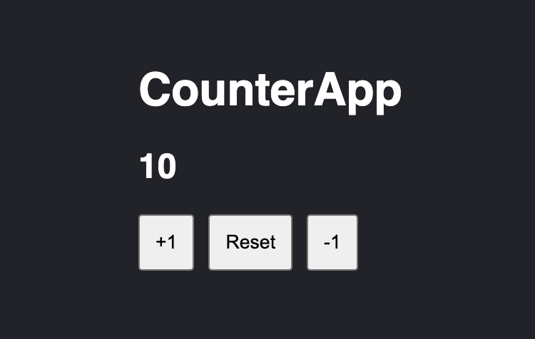

# Gif Expert App

This project was bootstrapped with [Vite](https://vitejs.dev/), as a template.

<p align="center">



</p>

### 🚧 **Important!!**

This project have an examples of how works [Jest](https://jestjs.io/docs/getting-started) as a testing tool:

  <br>
  <br>

## Install dependencies

In the project directory, you can run:

```
npm install
```

## Available Scripts

In the project directory, you can run:

```
npm run dev
```

Runs the app in the development mode.\
Open [http://localhost:3000](http://localhost:3000) to view it in the browser.

The page will reload if you make edits.\
You will also see any lint errors in the console.

```
npm run build
```

Builds the app for production to the `build` folder.\
It correctly bundles React in production mode and optimizes the build for the best performance.

The build is minified and the filenames include the hashes.\
Your app is ready to be deployed!

```
npm run test
```

Launches the test runner in the interactive watch mode.\
See the section about [running tests](https://jestjs.io/docs/getting-started) for more information.
